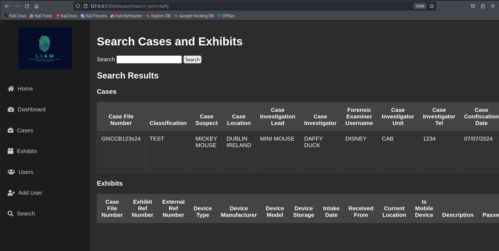
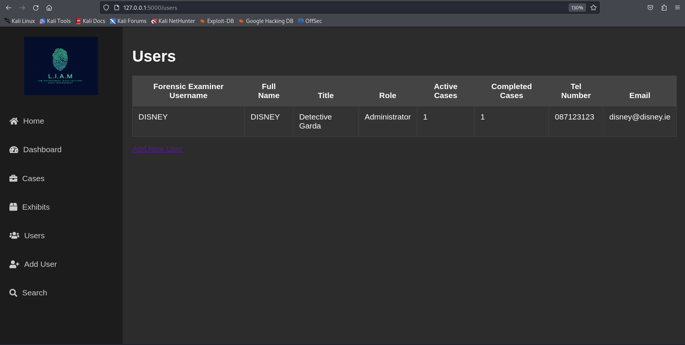
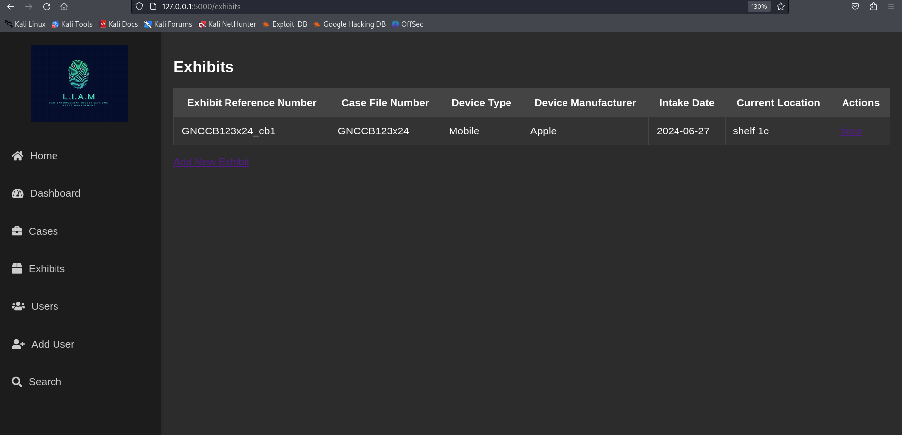
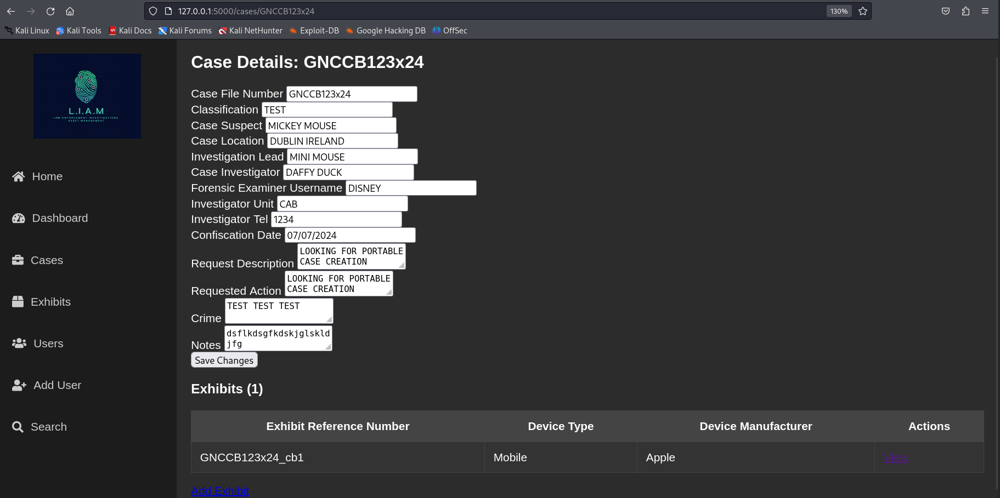
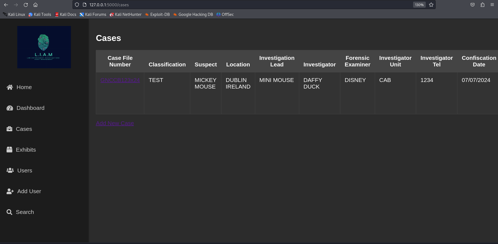
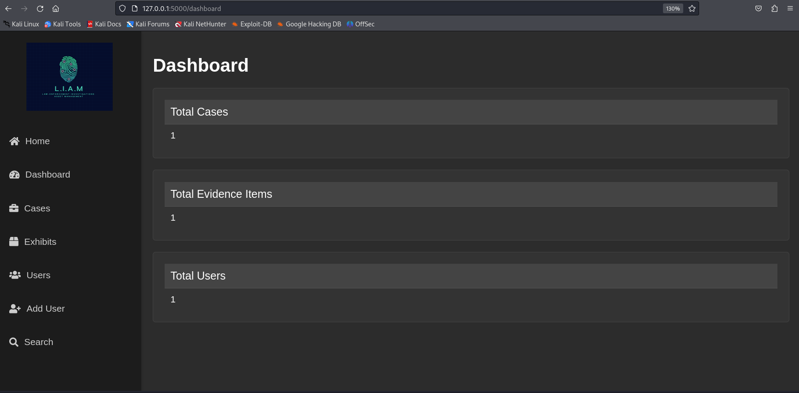

# L.I.A.M. - Law-Enforcement Investigations and Asset Management System

L.I.A.M is a simple Python Flask web application for managing digital forensic cases and digital forensic evidence items. It can use SQLite/SQL as the storage backend, and it is intended to be used as a workflow tool for receiving, booking, note-taking, and possibly reporting findings. It simplifies and helps in case management when dealing with a large (or small!) number of devices submitted for forensic analysis in a lab.
Ideally this might suit a small forensic lab that is too busy for an Excel sheet but doesn't have the budget for a paid tool.
This project can be run from minimal spec hardware using Ubuntu/linux.
Users can add in storage locations for exhibits, not date seized and what processes where ran on different exhibits 
It is aimed at Law Enforcement Digital Forensics Labs.

Project is fully dockerized and can be up and running in a small number of commands.

This project references on another open source project [Kirjuri](https://github.com/AnttiKurittu/kirjuri).

**Note**: This project is designed for operating on an air-gapped network.

## Features
- Case management
- Evidence tracking
- Reporting and analytics
- User authentication and roles

## TODO
- Add in autofill for certain items like dates/ sizes of media etc..
- report genereattion have it produce a nice PDF with the company/dept logo and all the particulars of the case
- tidy up the case details page
- enable and track the audit logging
- add in option of user to upload documents/pdf/docs etc... to a case(dont store in SQL specify a location in the local machine)
- add in option of user to upload pics of exhibits to a case (dont store in SQL specify a location in the local machine)
- make sure all the style packs are availble offline aswell (Put FONT AWESOME IN REPO!)
- in the dashboard dispay more statistics
- enable the login page

## Screenshots

### Search Cases and Exhibits


### Users


### Exhibits


### Case Details


### Cases


### Dashboard


## Installation
- Put in full install instructions
- Reccomend Ubuntu
- DOCKERISE!!!!!!
- HAVE IT RUN ON A RASPBERY PI
## Workflow of ProjectL.I.A.M.

```mermaid
graph TD
    A[Case Creation] --> B[Enter Exhibits]
    B --> C[Assign Tasks]
    C --> D[Evidence Tracking]
    D --> E[Note-taking]
    E --> F[Analysis & Findings]
    F --> G[Report Generation]
    G --> H[Case Review & Closure]
    
    subgraph Workflow
        direction LR
        A --> B --> C --> D --> E --> F --> G --> H
    end
    
    subgraph Additional Features
        B --> I[User Authentication & Roles]
        D --> J[Reporting & Analytics]
        H --> K[Archiving]
    end
